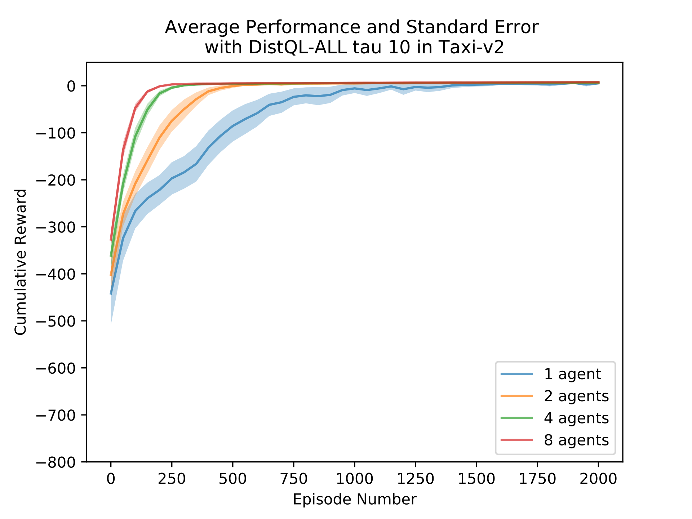

# Distribued Q-Learning 
Done as part of my masters degree, this project was inspired by recent advancements in speeding up the training of reinforcment learning algorithms on deep neural networks
like what [Gorila](https://arxiv.org/abs/1507.04296) and [A3C](https://arxiv.org/abs/1602.01783). 
Instead of opperating on deep neural networks though, I was interested in understanding if the same types of strategies could be applied 
to the traditional Q-Learning algorithm developed by Watkins. 

In order to train in parrallel, the experiences from the different agents must be combined together some how. In _Gorila_ and _A3C_ the network 
weights are combined. For this project, I had to develop my own combination equation for state-action Q-values.  
  

## Abstract 
Reinforcement learning can take single agents many sequential episodes in order to
learn. To decrease the number of episodes a single agent must complete to attain a desired
performance, researchers have looked to parallel learning architectures. DistQL is a parallel,
distributed, reinforcement learning system. The system uses multiple agent-environment
pairs, where agents can learn in parallel to each other and update a central QServer. DistQL
was applied to two environments. The results showed that it is possible to have a large
decrease in the number of episodes need for an agent to perform well compared to a single
agent, as the number of distributed agents increases.

The rest of the paper can be found [here](https://github.com/MaxRobinson/DistributedQMemory/blob/master/DistQL-Paper/DistributedQLearning.pdf) or via the link above.

## Brief Results
The results of the experiments provide insight into the performance of sets of agents when
compared to each other in the same environment. In addition, the results show how the
update methods for DistQL and the update frequency can effect learning performance. The
first environment examined is the Taxi World.

The below figures compares the performance of each set of 1, 2, 4, and 8 agents to each other using
DistQL-ALL, based on average cumulative reward compared to DistQL-Partial. Both figures shows that as the number of
agents increased, fewer episodes were require for each agent to reach a higher cumulative
reward. The figures also illustrates how much faster the set of 8 agents was able to converge
to an optimal policy when compared to the other sets of agents.

DistQL-ALL Average Cumulative in Taxi world with Tau = 10   | DistQL-Partial Average Cumulative in Taxi world with Tau = 10
:-------------------------:|:-------------------------:
  |  

Comparing DistQL-Partial to DistQL-ALL, the figures show there is still an increase in the rate of performance as the number of agents per
set increases, but it is less pronounced. The agents all take a little longer to learn in the
beginning and then start to differentiate after that, until convergence. This suggests that
the first part of the learning process is each agent exploring. After more and more states
are discovered, the aggregation of the value of the explored states helps to give the sets
with more agents a boost in learning. This suggests that a large part of the success of
DistQL-ALL is due to the shared exploration in combination with the aggregated Q-values.

